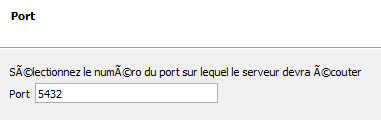
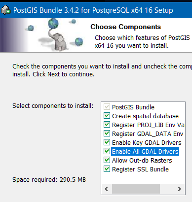

# Installer STEAN sous Windows
- [1 Prérequis](#prerequis)  
  - [1.1 PostgreSQL et PostGIS](#postgresl)  
  - [1.2 NodeJS et nodemon](#nodejs)  
- [2 STEAN](#steanwindows)  
  - [2.1 Configuration](#configuration)  
  - [2.2 Arrêt, mise à jour, démarrage de STEAN](#start)   

```{important}
Le déploient de STEAN sous Windows est dédié uniquement pour test en local.
```

<a id="top"></a>
<a id="prerequis"></a>
# 1 Prérequis

<a id="postgresl"></a>
## 1.1 PostgreSQL et PostGIS

[www.enterprisedb.com/downloads/postgres-postgresql-downloads](https://www.enterprisedb.com/downloads/postgres-postgresql-downloads)

Effectuer l'installation suivant les copies d'écran. Stack Builder est nécessaire pour installer de PostGIS.

**Dossier d'installation**


**Les composants à installer**  

Conseil: installer **pgAdmin** séparément.


Choisir le répertoire de stockage des bases de données.

  

Définir un mot de passe pour le superutilisateur postgresql.  

Laisser le port par défaut 5432 et en **localhost** pour une installation
locale de test.




Après la première phase d'installation, on installe **PostGIS** (stackbulider)  

```{note}
Vous pouvez également installer PostGIS séparément, mais c'est plus compliqué.
```
[Documentation d'installation PostGIS](https://postgis.net/documentation/getting_started/install_windows)

[Dépôt des paquets PostGIS](https://download.osgeo.org/postgis/windows/pg16/?C=M&O=D>)

Regarder [la vidéo](https://video.osgeo.org/w/57e27085-6352-43e6-b64a-c29c1dcda8ee), très bien expliquer!

```{image} stackbuiler1.png
:alt: stackbuiler
:width: 400px
```

* Sélectionner l'extension **PostGIS**  
```{image} stackbuiler2.png
:alt: stackbuiler
:width: 400px
```

* Sélectionner un répertoire de téléchargement.  
```{image} stackbuiler3.png
:alt: stackbuiler
:width: 400px
```
* Cliquer **2 fois** suivant pour commencer l'installation.

Demander de créer une **base spéciale** pour PostGIS et d'installer tous les pilotes **GDAL**.



Le dossier d'installation est identique à **PostgreSQL**.

* Renseigner le mot de passe du **super user** saisie lors de l'installation de PostgreSQL.

Préciser un nom de base de données pour PostGIS et lancer l'installation.

```{image} postgis2.png
:alt: postgis
:width: 400px
```
 
**PostgreSQL en local (configuration par défaut)**

Limiter l'accès au serveur PostgreSQl en local uniquement.  
Adapter le fichier D:\postgresql_data\pg_hba.conf
```
\# TYPE DATABASE USER ADDRESS METHOD

\# "local" is for Unix domain socket connections only

local all all scram-sha-256

\# IPv4 local connections:

host all all 127.0.0.1/32 scram-sha-256

\# IPv6 local connections:

host all all ::1/128 scram-sha-256

\# Allow replication connections from localhost, by a user with the

\# replication privilege.

local replication all scram-sha-256

host replication all 127.0.0.1/32 scram-sha-256

host replication all ::1/128 scram-sha-256
```
[Revenir en haut](#top)  
<a id="nodejs"></a>
## 1.2 NodeJS et nodemon

[Télécharger Nodejs](https://nodejs.org/en/download)

Un tutoriel d'installation](https://kinsta.com/fr/blog/comment-installer-node-js/)

Pour l'installation, laissez tout par défaut et cliquez!

* Vérifier le bon fonctionnement dans une console PowerShell.  
Obtenir la version de **nodejs**.
```
node --version
```
* npm est le gestionnaire de paquets de NodeJs.  
Obtenir la version du gestionnaore de paquet de  **nodejs**.

```
npm --version
```
[Revenir en haut](#top) 
<a id="steanwindows"></a>
# 2 STEAN

A partir de l'entrepôt [STEAN](<https://github.com/Mario-35/STEAN>), télécharger le script
[install.ps1](https://github.com/Mario-35/STEAN/blob/main/scripts/install.ps1) dans un dossier spécifique, exemple: C:\Users\votre_espace_utilisateur\STEAN

* [install.ps1](https://github.com/Mario-35/STEAN/blob/main/scripts/install.ps1) permet d'installer, de mettre à jour (si installation présente).
**Pour installer ou mettre à jour**  
Ouvrir une console **PowerShell ISE** , lancer le script [install.ps1](https://github.com/Mario-35/STEAN/blob/main/scripts/install.ps1).  

```{important}
Pour lancer le script, clic droit sur le fichier puis modifier. Lancer le dans la console intégrée. Via la console simple, le script ne fonctionne pas.
```
**Pour démarrer STEAN** 
Ouvrir une console **PowerShell ISE** , lancer le script run.sh.

[Revenir en haut](#top) 
<a id="configuration"></a>
## 2.1 Configuration 

Dans un navigateur saisir l'URL de base amendée de n'importe quel caractère, exemple:  
[localhost:8029/importenayouak](http:/localhost:8029/importenayoik)

Une de fenêtres de paramètres de connexion à PostgreSQL apparait.  

**Fenêtre Admin Access**  
Renseigner les identifiants de l'administrateur du serveur PostgreSQl local.  

```{image} AdminAccess.PNG
:alt: first_start
:width: 400px
```
Une fois effectué, vous basculez sur la fenêtre de configuration [http://localhost:8029/admin](http://localhost:8029/admin)
**Création du premier service** 
* Saisir le nom du service et le mot de passe  
* Spécifier les options  

Détails des options  
* ForceHTTPS : ajoute d'un s aux lienshttp, soit https.
* stripNull : supprime les clés avec des valeurs null (allège le JSON)
* canDrop : permet de supprimer les contenus de la bases de données, mais pas la base.
* unique : ajout d'une contrainte,  les noms des datatstream doivent être uniques.

Détails des extensions  
* users : gestion des utilisateurs
* lora : gestion des capteurs loras
* tasking : gestion du tasking (pas encore implanté) mais dans la norme STA
* mqtt : capable de recevoir les messages mqtt
* multidatastream : gestion du multidatastream
* hightPrecison :  nombre après la virgule plus important
* resultNumeric : Le result est uniquement numeric (comme FROST)

Valider la création, bouton **Create Service**. Le mot de passe PostgreSql vous sera demandé.  

```{image} service_Agrhys.png
:alt: first_start
:width: 400px
```  
A droite, vous avez l'URL du service http://localhost:8029/agrhys/v1.1  
la Console Query est http://localhost:8029/agrhys/v1.1/query  

[Revenir en haut](#top) 
<a id="start"></a>
## 2.3 Arrêt, mise à jour, démarrage de STEAN

* **Arrêt**: dans la console **PowerShell ISE** où STEAN a été lancé, **touche crtl+c**, puis fermer la console **PowerShell ISE**.

* **Mise à jour**: Arrêter STEAN au préalable, ouvrir console **PowerShell ISE**, charger et lancer le script.
[install.ps1](https://github.com/Mario-35/STEAN/blob/main/scripts/install.ps1), installe ou met à jour et lance le service

* **Démarrage** lancer le script
[run.ps1](https://github.com/Mario-35/STEAN/blob/main/scripts/run.ps1), lance le service sans réinstaller

[Revenir en haut](#top) 
