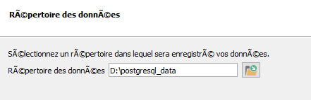
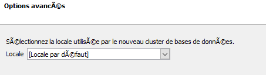

- [1 Prérequis](#prerequis)  
  - [1.1 PostgreSQL et PostGIS](#postgresl)  
  - [1.2 NodeJS et nodemon](#nodejs)  
- [2 STEAN](#stean)  
  - [2.1 Configuration](#configuration)  
  - [2.2 Arrêt, mise à jour, démarrage de STEAN](#start)  
  - [2.3Décodage du fichier de configuration](#configuration)  

<a id="top"></a>
<a id="prerequis"></a>
# 1 Prérequis

<a id="postgresl"></a>
## 1.1 PostgreSQL et PostGIS

[www.enterprisedb.com/downloads/postgres-postgresql-downloads](https://www.enterprisedb.com/downloads/postgres-postgresql-downloads)

Effectuer l'installation suivant les copies d'écran. Stack Builmder est nécessaire pour installer de PostGIS.

Dossier d'installation


Les composants à installer. Conseil: installer **pgAdmin** séparément.


Choisir le répertoire de stockage des bases de données.



Laisser le port par défaut et en **localhost** pour une installation
locale de test.



Après la première phase d'installation, on installe **PostGIS** (stackbulider)  

> [!NOTE]
> Vous pouvez également installer PostGIS séparément, mais c'est plus compliqué.

[Documentation d'installation PostGIS](https://postgis.net/documentation/getting_started/install_windows)

[Dépôt des paquets PostGIS](https://download.osgeo.org/postgis/windows/pg16/?C=M&O=D>)

Regarder [la vidéo](https://video.osgeo.org/w/57e27085-6352-43e6-b64a-c29c1dcda8ee), très bien expliquer!


* Sélectionner l'extension **PostGIS**


* Sélectionner un répertoire de téléchargement.


* Cliquer **2 fois** suivant pour commencer l'installation.

Demander de créer une **base spéciale** pour PostGIS et d'installer tous les pilotes **GDAL**.


Le dossier d'installation est identique à **PostgreSQL**.

* Renseigner le mot de passe du **super user** saisie lors de l'installation de PostgreSQL.

Préciser un nom de base de données pour PostGIS et lancer l'installation.

  
 
**PostgreSQL en local (configuration par défaut)**

Limiter l'accès au serveur PostgreSQl en local uniquement.  
Adapter le fichier D:\postgresql_data\pg_hba.conf
```
\# TYPE DATABASE USER ADDRESS METHOD

\# "local" is for Unix domain socket connections only

local all all scram-sha-256

\# IPv4 local connections:

host all all 127.0.0.1/32 scram-sha-256

\# IPv6 local connections:

host all all ::1/128 scram-sha-256

\# Allow replication connections from localhost, by a user with the

\# replication privilege.

local replication all scram-sha-256

host replication all 127.0.0.1/32 scram-sha-256

host replication all ::1/128 scram-sha-256
```
[Revenir en haut](#top)  
<a id="nodejs"></a>
## NodeJS et nodemon

[Télécharger Nodejs](https://nodejs.org/en/download)

Un tutoriel d'installation](https://kinsta.com/fr/blog/comment-installer-node-js/)

Pour l'installation, laissez tout par défaut et cliquez!

* Vérifier le bon fonctionnement dans une console PowerShell.  
Obtenir la version de **nodejs**.
```
node --version
```
* Gestionnaire de paquets NodeJs, npm  
Obtenir lea version du gestionnaore de paquet de  **nodejs**.

```
npm --version
```

[Revenir en haut](#top)  
# STEAN

A partir de l'entrepôt [STEAN](<https://github.com/Mario-35/STEAN>), télécharger les scripts
[install.ps1](https://github.com/Mario-35/STEAN/blob/main/scripts/install.ps1) et [run.ps1](https://github.com/Mario-35/STEAN/blob/main/scripts/run.ps1)
dans un dossier spécifique, exemple: C:\Users\votre_espace_utilisateur\STEAN

Ouvrir une console PowerShell et lancer le script
[install.ps1](https://github.com/Mario-35/STEAN/blob/main/scripts/install.ps1).  

>[!NOTE]
>Si vous obtenez l'erreur **PostgreSQL is installed. (16)**.
>Editez le fichier install.ps1 à la ligne 112 et remplacer  
```POSTGIS = "$latest\share\contrib" par $POSTGIS = "$POSTGRES\$latest\share\contrib"```

[Revenir en haut](#top)  
## Configuration 

Dans un navigateur saisir l'URL de base amendée de n'importe quel caractère, exemple:
[localhost:8029/importenayouak](localhost:8029/importenayoik)

La fenêtre de configuration vierge apparait. A vous de la renseigner.

**Onglet service**


**Onglet Admin (PostgreSQL)**


Après validation, le service est accessible selon le nom du service
saisi sous l'URl <http://localhost:8029/agrhys/v1.1/>

[Revenir en haut](#top)  
<a id="start"></a>
## Arrêt, mise à jour, démarrage de STEAN

* **Arrêt**: dans la console PowerShell où STEAN a été mancé, **touche crtl+c**

* **Mise à jour**: relancer le script
[install.ps1](https://github.com/Mario-35/STEAN/blob/main/scripts/install.ps1), installe ou met à jour et lance le service

* **Démarrage** lancer le script
[run.ps1](https://github.com/Mario-35/STEAN/blob/main/scripts/run.ps1), lance le service sans réinstaller

[Revenir en haut](#top)  
## Décodage du fichier de configuration

La phase de configuration génère un fichier codé nommé
**\~\STEAN\api\configuration\configuration.json**.

**Pour le modifier**

Dans une console CMD ou PowerShell, se placer dans le fichier de
configuration et lancer la commande
```
node decode.js
```

Copier/coller la sortie dans un éditeur de texte, sans les caractères bizards.

Adapter ou corriger la configuration. Exemple: retirer le v devant 1.1 à la ligne 40.

Sauvegarder le contenu dans le fichier **C:\Users\cgeneste\STEAN\api\configuration\configuration.json**.

Relancer le service, puis aller à <http://localhost:8029/agrhys/v1.1/>, si le service se nomme **agrhys.**

Du coup, Le **Query* est <http://localhost:8029/agrhys/v1.1/Query>

 

 
