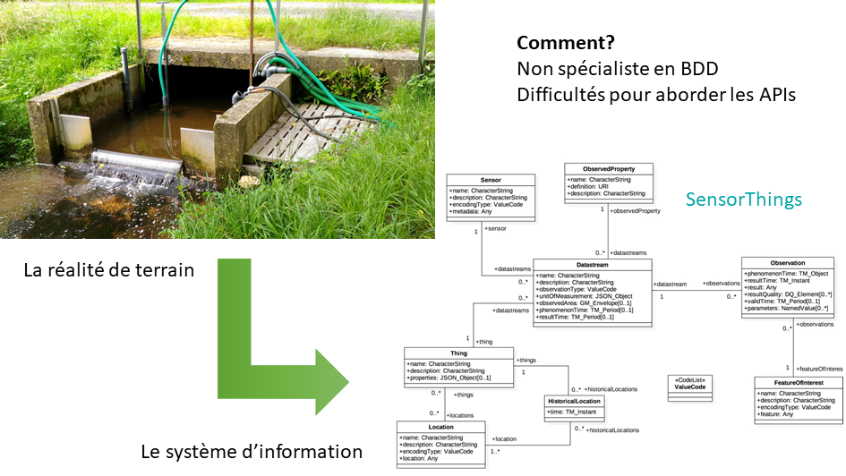

# **SensorThings appliqué à l'ORE Agrhys**
  
Appliquer le modèle de données Sensorthings à un observatoire, tel que l'ORE Agrhys, n'est pas trivial au premier abord.  
Comment restrancrire la réalité de terrain vers Sensorthings?   

Sacanht que:  
*  Je ne suis pas pécialiste en base de données
*  L'utilisation de l'API SensorThings m'est diffcile
*  La compréhension du modèle de données SensorThins n'est pas aisée  

Pour soulever ces verrous, ce travail nécessite 3 compétences:
