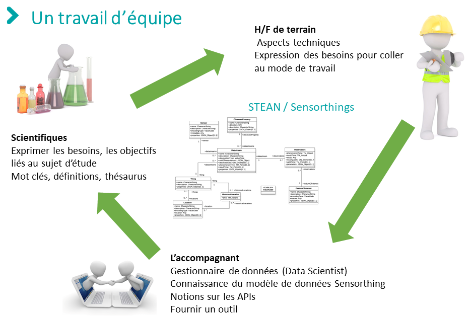

# Retrour d'expérience de l'ORE Agrhys
- [1. Qui parle](#qui_parle)    
- [2. Introduction](#intro)
- [3. Configurer une instance STEAN](#conf)  
  - [3.1. Fichier de configuration](#fichier_conf)
  - [3.2. Comment ce fichier de configuration fonctionne-t-il?](#fonc_conf)

## 1. Qui parle ?
Christophe Geneste, ingénieur d'étude INRAE, administrateur de plateformes, d'applications web et de bases de données à l'UMR SAS.

## 2. Introduction
Appliquer le modèle de données Sensorthings à un observatoire, tel que l'ORE Agrhys, n'est pas trivial au premier abord.  
Comment restrancrire la réalité de terrain vers Sensorthings?   

Sachant que:  
*  Je ne suis pas spécialiste en base de données
*  L'utilisation de l'API SensorThings m'est difficile
*  La compréhension du modèle de données SensorThings n'est pas aisée  

Pour lever ces verrous, ce travail nécessite 3 compétences. Vous les posséder, alors vous êtes autonomes!

[Revenir en haut](#top) 

## 3. Configurer une instance STEAN  
[STEAN](https://github.com/Mario-35/STEAN) est une implémentation de l'API SensorThings. [Pour en savoir plus](https://sensorthings.geosas.fr/)  

La première difficulté est de déterminer les [Things](https://geosas.fr/sofair-book/page/chap-sensorthings/things.html) et Features of Interest. Que doivent-ils représenter? Ici, le/la scientifique intervient majoritairement.
la seconde étape est la définition de Sensors et Observed Properties. La/le scientifique travaillent de concert avec le personnl de terrain essentiellemnt.

Dans le cas de l'ORE Agrhys:
* le point de mesure est attribué aux entités [Things](https://geosas.fr/sofair-book/page/chap-sensorthings/things.html)  
Exemple: le point de mesure E30 correspond à l'éxutoire du bassin versant du Puits dont les coordonnées géographiques sont [-4.1208244,47.9441891]
* Sensors = capteur ou analyseur
* Observed properties = grandeur physique mesurée ou analysée.

### 3.1. Fichier de configuration
Maintenant que les [Things](https://geosas.fr/sofair-book/page/chap-sensorthings/things.html), les Features of Interest, les Sensors et les Observed Properties sont définis, comment configurer une instances STEAN? C'est ici que le Data Scientist commence à intervenir. Il doit fournir les outils et les formalismes pour accompganger le scientifique et le personnel de terrain dans l'intégration de leurs données vers le modèle de données SensorThings.  

Dans la cas d'un observatoires, nous avons produit un fichier tableur dit de configuration. Les informations collectées au travers de ce fichier sont traitées par un script Python permettant de configuer une instance STEAN. L'alimentation en données sera effectuée ultérieurement.

### 3.2. Comment ce fichier de configuration fonctionne-t-il?  
Il est composé de 6 onglets principaux:
* Lisez-moi: quide l'urlisateur dans la saisie
* 1_observedProperty
* 2_sensor
* 3_thing
* 4_datastream
* 5_featureOfInterest

